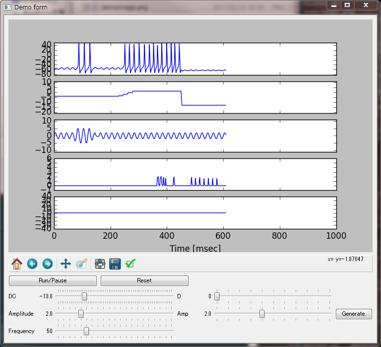

RealtimeSimulation
====

# Description
PyQt で単一神経細胞のリアルタイムシミュレーションができるアプリケーション

# Requirement
- Python 2.7.x
- numpy
- PyQt4
- matplotlib

# Usage
### アプリの起動  
`$ python matplot.py`

### "Run/Pause" ボタン
シミュレーションの開始と一時停止

### "Reset" ボタン
シミュレーションのやりなおし

### "Amplitude" スライダー
周期入力の振幅

### "Frequency" スライダー
周期入力の周波数

### "Amp" スライダー
外部刺激の大きさ

### "Generate" ボタン
外部刺激の入力

# Install
以下のコマンドで任意のディレクトリに clone してください。  
`$ git clone git@github.com:matsu490/RealtimeSimulation.git`  
または任意のディレクトリに ZIP ファイルをダウンロードして解凍してください。

# Licence
Copyright (c) 2017 matsu490  
Released under the MIT license  
https://github.com/matsu490/MNISTer/blob/master/LICENSE.txt  

# Author
[matsu490](https://github.com/matsu490)
